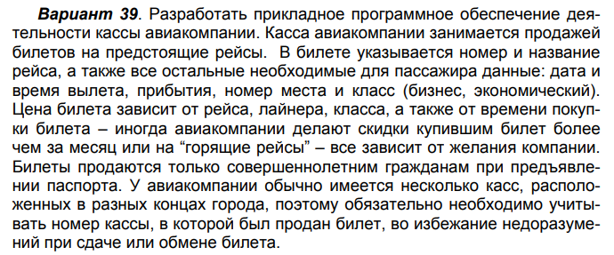

# :disappointed_relieved::rage::worried::worried::worried:Есть 4 задания:worried::worried::worried::rage::disappointed_relieved:
* Запросы UNION INSERT DELETE (4 штуки)
* Erwin -- сделать по нашей схеме из FoxPro (Erwin -- программа, с первого раза ни у кого не получиось ---- Киндакова), должны быть два уровня (физический и логический), а также инверсные и альтернативные ключи.
* Техзадание -- рекомендации по разработке технического задания. 
Тех. задание – это текстовый документ, объемом не более 3 страниц А4, но лучше  1,5 стр. Обычно составляется разработчиком (или  группой разработчиков) после дебатов с заказчиком. В нем синтезируются пожелания заказчика и возможности исполнителя.
Он должен отвечать на вопросы, сформулированные в части I Требований к КП. 
Как правило, содержит следующую информацию: 
1. технические требования – можно посмотреть у Гурвица со 156 стр. (описание бизнес-процесса) < =10 строк. Эта информация должна очень конкретно описывать предметную область в рамках ограничений и требований,  принятых для выбранного проекта. Дополнение к пункту 1)
Выполните разработку программного комплекса в соответствии с тре-
бованиями, подтверждающими квалификацию разработчика прикладного
программного обеспечения. Программный комплекс не должен терять ра-
ботоспособности при некорректных действиях пользователя. В интерфей-
се должны использоваться только термины, понятные пользователю.
Появление англоязычных сообщений СУБД недопустимо. Язык диалога
должен категорически исключить компьютерный сленг.
2. требования по функциональности (перечисление основных реализуемых функций) 
3. требования по интерфейсу (список документов сопровождения, текущей и итоговой отчетности, финансовых документов и т.п. ).  В этом пункте необходимо  описать или нарисовать требуемые документы,  которые будут формироваться на основе БД. В БД должны содержаться все необходимые данные для формирования этих документов.  Кроме того  необходимо  подготовить экранные формы для  добавления информации и работы с этими документами. 
4. требования по безопасности (может не быть) 
5. календарный план выполнения проекта (соответствует плану в требованиях, но более детальный) 
Разработанное тех. задание  является первой частью  отчета по КП. Содержит постановку задачи.

Пример 
* Отчет -- сделать отчёт по всем проделанным лабам, подправить первые запросы, так как мы перестраивали схему 

#  Работаем в FoxPro 9

вот ссылочка 
https://drive.google.com/drive/folders/19ZZFUAOf29R6J0Km-eYR0RZHvOx58wtf

# Наши таблицы, что у нас будут таблицы
 * Train
 * Trains_stats
 * Stations
 * Arrivals
 * Departures
 * Tickets
 * Driver
 * Driver_route

# Arrivals -- расписание прибытий для всех станций 
 * arrival_id -- уникальный номер строки таблицы  --- int [[[[ПЕРВИЧНЫЙ КЛЮЧ]]]]
 * station_id -- уникальный номер строки таблицы Stations  --- int 
 * train_routes_id -- уникальный номер строки таблицы Trains_routes --- int 
 * arr_date -- дата прибытия поезда на стацию --- date 
 * platformway  -- Путь/платформа --- int

# Departures -- расписание прибытий для всех станций 
 * departure_id -- уникальный номер строки таблицы --- int [[[[ПЕРВИЧНЫЙ КЛЮЧ]]]]
 * station_id -- уникальный номер строки таблицы Stations  --- int 
 * train_routes_id -- уникальный номер строки таблицы Trains_routes --- int 
 * dep_date -- дата прибытия поезда на стацию --- date 
 * platformway  -- Путь/платформа --- int

# Tickets
 * dep_id -- уникальный номер строки таблицы Trains_routes --- int 
 * price -- цена одного билета --- int
 * seats -- свободные места -- int

# Driver
 * driver_id -- уникальный номер машиниста --- int [[[[ПЕРВИЧНЫЙ КЛЮЧ]]]]
 * surname -- фамилия --- string
 * name -- имя --- string

# Driver_route
* route_id -- уникальный номер строки таблицы Trains_routes --- int
* driver_id -- уникальный номер машиниста --- int

# Stations
 * station_id -- уникальный номер строки таблицы Stations --- int [[[[ПЕРВИЧНЫЙ КЛЮЧ]]]]
 * station_name -- имя станции (Ленинградский вокзал) --- string
 * location -- город string -- если всё плохо
 * platfromway_amount -- количество путей/платформ --- int

# Trains_routes --- главная табличка
 * train_routes_id -- уникальный номер строки таблицы Trains_stats --- int [[[[ПЕРВИЧНЫЙ КЛЮЧ]]]]
 * train_route_name -- например №724В ЛАСТОЧКА  --- string
 * station_from_id -- ID станции ОТКУДА уникальный номер строки таблицы Stations --- int
 * station_to_id -- ID станции КУДА уникальный номер строки таблицы Stations  --- int
 * arrival_hour -- время прибытия часы --- int
 * arrival_minutes -- время прибытия минуты --- int
 * departure_hour  -- время отбытия часы --- int
 * departure_minutes  -- время отбытия минуты --- int
